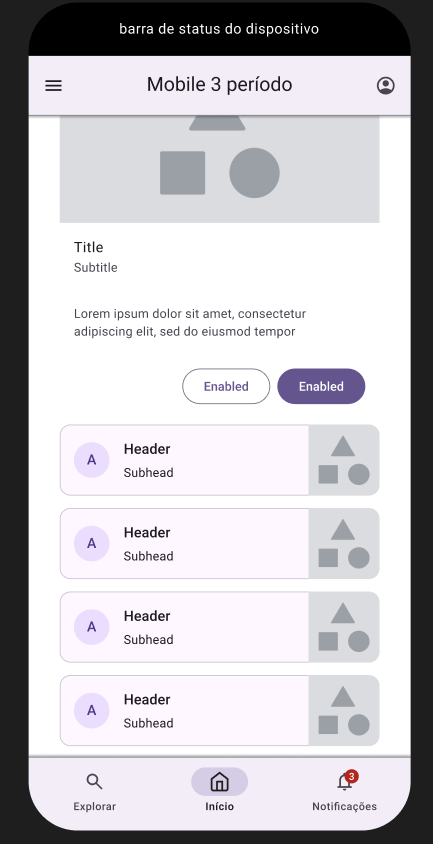
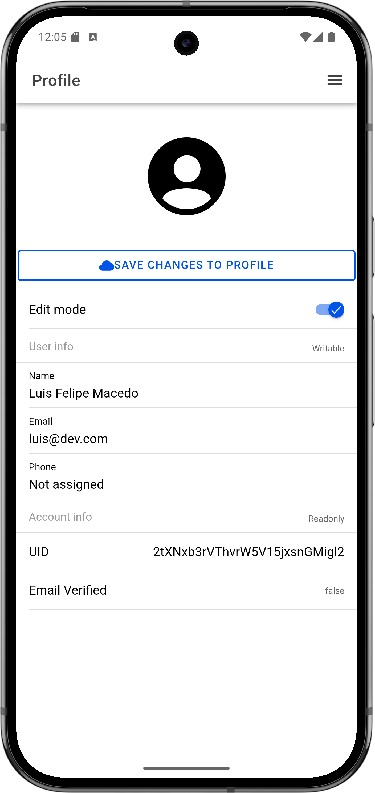

# Projeto 3º Período - Análise e Desenvolvimento de Sistemas

## Sobre o Desenvolvimento de Aplicativos Móveis.

O desenvolvimento de aplicativos móveis é uma área em constante evolução, com novas tecnologias e abordagens surgindo regularmente. Existem três principais abordagens para o desenvolvimento de aplicativos móveis: nativo, híbrido e web (PWAs).

O desenvolvimento móvel requer um nível de conhecimento mais especializado, soluções mobile requerem uma quantidade maior de desenvolvedores, estes são especializados nos desenvolvimento de diferentes plataformas (Android e iOS).
O desenvolvimento de aplicativos nativos é complexa, custosa e possui um grande "overhead" no planejamento tanto financeiro quanto do ciclo de vida do aplicativo.

Aplicativos nativos são rápidos, extremamente performáticos possuindo acesso direto aos recursos do dispositivos e leves. Em contrapartida, o aplicativo híbrido têm um ciclo de vida mais rápido, novas atualizações surgem com mais frequência e o custo de desenvolvimento é reduzido.

Entretanto, devemos levantar as limitações e as desvantagens de cada tecnologia, assim como os benefícios que cada uma pode oferecer. O desenvolvimento híbrido feito de maneira incorrreta pode levar a uma péssima experiência do usuário, aplicativos lentos, pesados e com desempenho insatisfatório.

## Sobre o Projeto.

### Roadmap

#### Entrega Preliminar.

-   [x] Criação de wireframes.

-   [x] Documentação do Design escolhido e tomadas de decisão.

-   [x] Definição da API.

-   [x] Documentação dos critérios de escolha da api.

-   [x] Apresentar um apk instalado em dispositivo móvel utilizando o Ionic.

-   [x] Atualização da plataforma de projetos ( fase de iniciação e planjemento ).

-   [x] Apresentação em slideshow do conteúdo desenvolvido e dos insights obtidos.

#### Entrega Final.

-   [x] Implementação de um feed que consuma dados periodicamente da api escolhida na Etapa 1.

-   [x] Design e Layout

-   [x] Implementação de uma tela de apresentação dos integrantes do grupo.

-   [x] Implementação de autenticação com Firebase Auth.

-   [x] Implementação de cadastro de usuário para autenticação com o Firebase Auth.

-   [x] Implementação de funcionalidade livre.

# Preliminar

## Wireframe

A escolha do design é um passo importante, pois ele define como o usuário será recebido e como o mesmo poderá interagir com a aplicação. Uma boa escolha de design cativa o cliente e atrai o seu interesse para explorar as funcionalidades. O design precisa ser coerente com os serviços oferecidos pela aplicação.

O primeiro design oferece uma interface voltada para o e-commerce, e é uma boa interface, porém não adere a ideia do projeto. Escolhemos uma api informativa que fornece dados de campeonatos, partidas e jogadores de futebol. A proposta do projeto é fornecer informações sobre o futebol e não vender produtos relacionados a ele. Já o segundo design focado em card informativos, é mais coerente pois proporciona ao usário blocos de informações que podem ser explorados, revelando novas informações e funcionalidades.

Portanto, dos designs apresentados podemos dizer que o segundo apresenta uma conexão maior e mais coesa com a proposta do projeto. A escolha do mesmo foi principalmente impulsionada pela escolha da api. Visto que, a o design é voltado para a apresentação de informações e dessa forma será mais propício para utilização na aplicação já que a api escolhida fornece dados em tempo real sobre o futebol.

[Wireframe escolhido](https://www.figma.com/design/8w1FQAyWoI9W8ZJiUuh3VZ/Wireframe-Mobile-2?node-id=0-1&t=Kpxm1eMkuq3NiR30-1)

## Escolha da API.

<!-- [Documentação da API](./API/README.md) -->

As api's são serviços externos, nas arquiteturas modernas é comum encontrar a utilização de diversas api's em um único projeto. Elas forncem uma forma de agregar informações e funcionalidades a uma aplicação sem necessariamente passar pelo processo de desenvolvimento de servidores e bancos de dados.
Nosso projeto consiste em um aplicativo informativo, fornece dados de futebol, estatísticas, tabelas de campeonatos, informações sobre jogadores e mais. Com esse conceito em mente buscamos uma api que fosse capaz de nos fornecer dados estáticos e em tempo real, que houvesse suporte a paginação e que fosse composta por dados dinâmicos como imagens, vídeos e listas.

Enquanto filtramos entre diversas api's disponíveis encontramos uma API brasileira que inclusive gostaríamos de ter utilizado, mas não conseguimos permissão para acesso.
Durante a pesquisa encontramos diversas api's pagas e pouquíssimas gratuitas.
Das api's gratuitas a grande maioria não oferecia suporte a dados brasileiros ou não cumpriam 100% os requisitos do projeto.
No final, a api escolhida foi a [Football Data](https://www.football-data.org/). É uma API de dados de futebol que fornece informações sobre ligas, times, jogadores e estatísticas de partidas. Possui endpoints para acessar listas de campeonatos, partidas encerradas e em andamento, assim como detalhes de campeonatos, times e jogadores.
A API é gratuita para uso com opções pagas para acesso a dados mais específicos e séries históricas.

Ao escolhermos uma api que se encaixa na concepção do projeto o desenvolvedor ganha um aumento de produtiviade durante o ciclo de vida da aplicação e também facilidade para implementar novas funcionalidades. Além disso, o utilizador se beneficiará com uma aplicação concisa e com atualizações regulares, o que contribuirá com a experiência do usuário.
A escolha correta da api também evita a aglomeração de serviços utilizados em uma única/múltiplas funcionaliade(s), o que pode trazer um aumento de complexidade no código e dificuldade de manutenção.

Requisitos funcionais da API.

1. Informações dinâmicas que atualizam periodicamente.
2. Suporte a mecanismos de paginação.
3. Conteúdo dinâmico (Imagens, textos.) - tipo feed de notícias.
4. Uso gratuito.

# Entrega Final.

## Feed, Design e Funcionalidade Livre.

Para a entrega final, implementamos o consumo da api escolhida na etapa 1, seguindo o layout definido no design escolhido. 

Escolhemos uma API que fornece dados de futebol, incluindo informações sobre campeonatos, partidas e jogadores.
- A API escolhida é a [Football Data](https://www.football-data.org/).

Seguimos o design escolhido, que é voltado para a apresentação de informações de forma clara e organizada. Mantivemos a estrutura do wireframe, com cards informativos.

`A primeira imagem é o wireframe escolhido, seguido pelas telas implementadas no aplicativo.`

A implementação da entrega final inclui:

Um feed que consome dados periodicamente da API. Onde exibimos informações atualizadas periodicamente em 3 seções diferentes do aplicativo, através das seguintes telas: 

- Tabela de pontos do campeonato.
    Esta tela representa a tabela de pontos do Campeonato Brasileiro Série A, exibindo as posições dos times, pontos e outros detalhes relevantes.

- Partidas do Campeonato.
    Esta tela exibe as partidas do Campeonato Brasileiro Série A, mostrando os jogos agendados, resultados e outras informações pertinentes. Com filtros para exibir partidas encerradas, em andamento e agendadas.

- Melhores Jogadores do Campeonato.
    Esta tela apresenta os melhores jogadores do Campeonato Brasileiro Série A, destacando suas estatísticas e desempenhos.

E uma tela de funcionalidade livre, onde implementamos um perfil de usuário, onde o mesmo pode visualizar e editar suas informações pessoais que ficarão salves no Firebase Authentication.

- Tela de perfil do usuário.
    Esta tela permite que o usuário visualize e edite seu perfil, incluindo informações pessoais.

Com isso concluímos 3 requisitos funcionais, feed que consome dados, design e layout, e funcionalidade livre com a tela de perfil do usuário.

## Documentação de implementação da Autenticação.

Para a implementação dos requisitos de autenticação e cadastro de usuários no firebase, utilizamos o Firebase Authentication através do AngularFire, que é a biblioteca oficial do Angular para integração com o Firebase.

Usuário são autenticados na tela de login, caso o usuário se registre, ele será automaticamente autenticado e redirecionado a tela principal.
O usuário é proibido de acessar qualquer tela que não seja a de login, cadastro, boas-vindas e sobre.

O protocolo de proteção das páginas é feito através do Angular Router, onde as rotas estão protegidas com Angular Guards.

Internamente os guards chamam o servilo authService, que verifica através do sdk do firebase se o usuário está autenticado.
Há um observable que se inscreve no método de estado de autenticação do firebase e resolve o estado do usuário,
retornando um booleano ou urlTree para redirecionamento.

Angular Guards são declaradas no módulo de rotas, onde cada rota que deve ser protegida possui o guard associado.

Referências:

- [Preventing Unauthorized Access with Angular Router](https://angular.dev/guide/routing/common-router-tasks#preventing-unauthorized-access)

- [AngularFire Authentication Guide](https://github.com/angular/angularfire/blob/main/docs/auth.md)

Assim cumprimos os requisitos de autenticação e cadastro de usuários, garantindo que apenas usuários autenticados possam acessar as funcionalidades do aplicativo.
<!-- ## Documentação suplementar firebase auth

-   [Introdução ao Firebase Authentication (Documentação Oficial)](https://firebase.google.com/docs/auth/web/start?hl=pt-br)

-   [Guia de Autenticação com AngularFire](https://github.com/angular/angularfire/blob/main/docs/auth.md#authentication)

-   [Configuração do Firebase Authentication para Web](https://firebase.google.com/docs/auth/web/start?hl=pt-br#web_2)

-   [Referência da API de Autenticação do Firebase](https://firebase.google.com/docs/reference/js/auth?hl=pt-br) -->

## Apresentação dos integrantes do grupo.

A tela de apresentação do grupo foi implementada para atender ao requisito de apresentar os integrantes do grupo. Nela foram criados cards informativos, contendo gifs, informações e curiosidades sobre cada integrante de uma maneira leve e divertida e cumprindo o último requisito funcional da entrega final.

## Integrantes

Luis Felipe Macedo, Lucas Augusto, Gabriel Mufalani, Gabriel Vargas.
básico

## APK.

[Link para o arquivo apk de testes da entrega pre-liminar](./Pre-liminar/APK)

## Apresentação.
